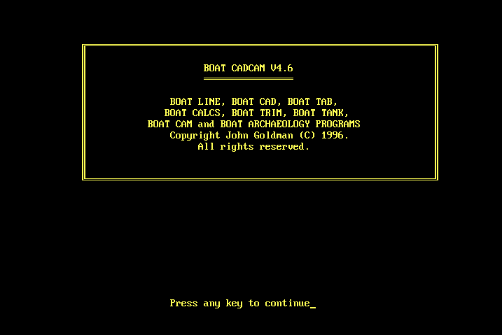

# boatcad-online
DOS boat designer in the browser


## Setup
Clone this repository either by downloading the zip from the Github website, or getting a Github account and typing the following in your terminal:
```
git clone https://github.com/bit-by-byte/boatcad-online.git
```

Go into the project directory from your terminal and run:
```
npm install
npm run start
```

Those commands make take a minute or two to complete, but once done, the app should display in your browser automatically.
If it does not, go to the link shown in your terminal window.

Use your favourite text editor to modify the source code, and the updates will automatically be visible in the browser on save.
[Vscode](https://code.visualstudio.com/) is a good text editor but you're free to choose what you want.
